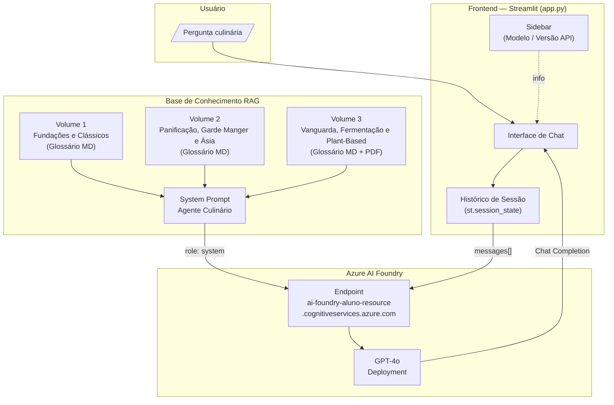
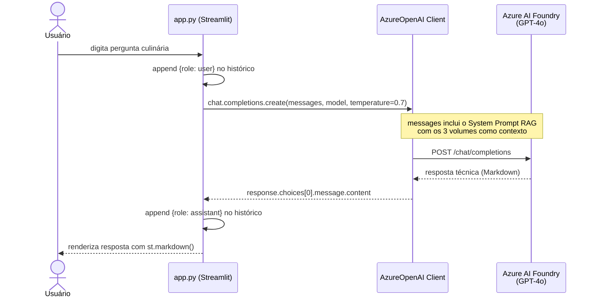
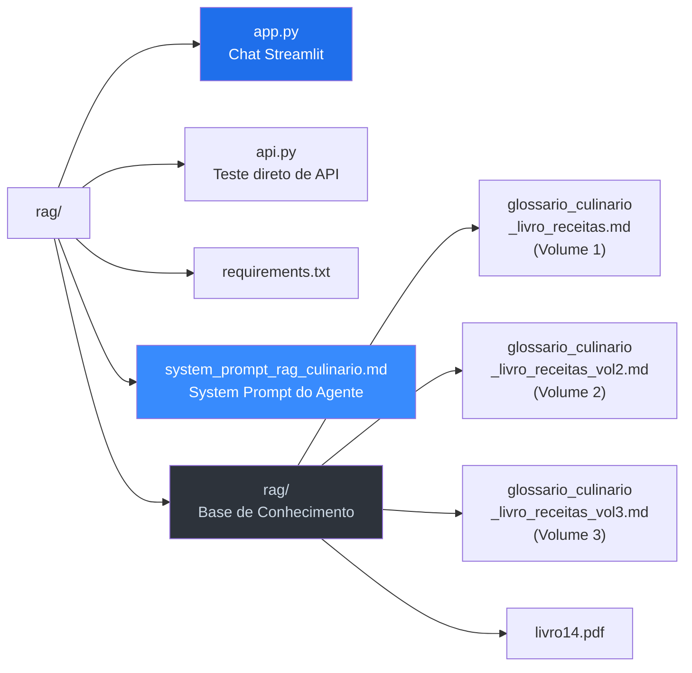
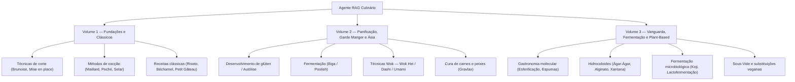
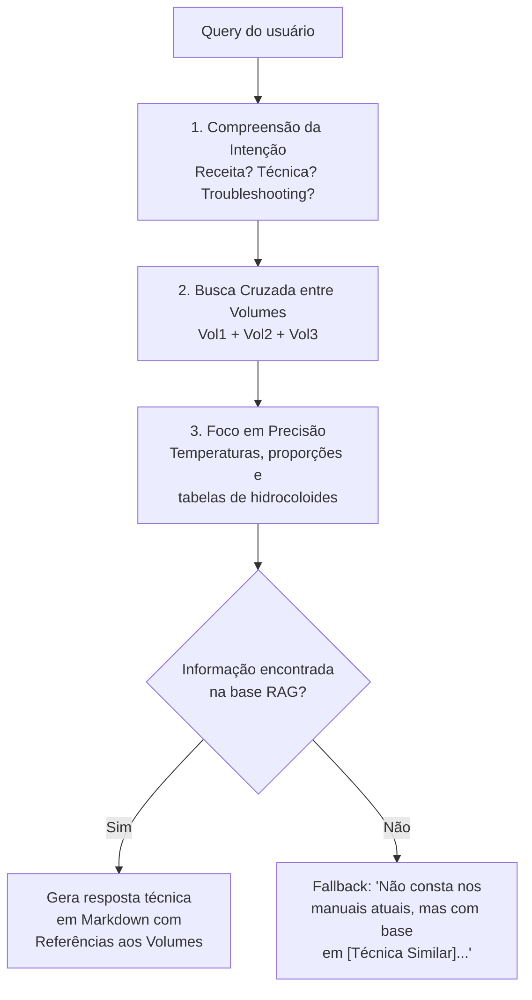

# Culinario RAG — Agente Culinário com Azure AI Foundry

Chat de IA especializado em **alta gastronomia e ciência culinária**, construído sobre **Azure AI Foundry (GPT-4o)** com padrão **RAG (Retrieval-Augmented Generation)**. O projeto serve como prova de conceito para validar o uso do AI Foundry em aplicações conversacionais com base de conhecimento estruturada.

---

## Visão Geral da Arquitetura



---

## Fluxo de uma Mensagem



---

## Estrutura do Projeto



---

## Base de Conhecimento (Volumes RAG)

O agente busca respostas nos três volumes do **Grande Guia Culinário**:



---

## Lógica de Inferência do Agente (Chain of Thought)



---

## Stack Tecnológica

| Camada | Tecnologia |
|---|---|
| Frontend | Streamlit |
| Modelo | GPT-4o (Azure AI Foundry) |
| SDK | `openai` (AzureOpenAI client) |
| API Version | `2025-01-01-preview` |
| Base de Conhecimento | Markdown (3 volumes) + PDF |
| Autenticação | Azure API Key via `st.text_input` |

---

## Como Executar

```bash
# 1. Criar e ativar ambiente virtual
python -m venv venv
.\venv\Scripts\Activate.ps1

# 2. Instalar dependências
pip install -r requirements.txt

# 3. Rodar o chat
streamlit run app.py
```

Insira sua **Azure API Key** no campo da interface e comece a conversar com o agente culinário.

---

## Exemplos de Uso do Agente

| Pergunta | Volume Consultado | Resposta esperada |
|---|---|---|
| "Meu molho de queijo separou, o que fazer?" | Vol 1 + Vol 3 | Química da emulsão + uso de Xantana |
| "Como fazer pão do zero?" | Vol 2 | Autólise, Ponto de Véu, Focaccia Genovesa |
| "O que é esferificação?" | Vol 3 | Técnica molecular com Alginato + Cloreto de Cálcio |
| "Qual a temperatura para Sous-Vide de frango?" | Vol 3 | Temperatura exata + regras de segurança alimentar |
